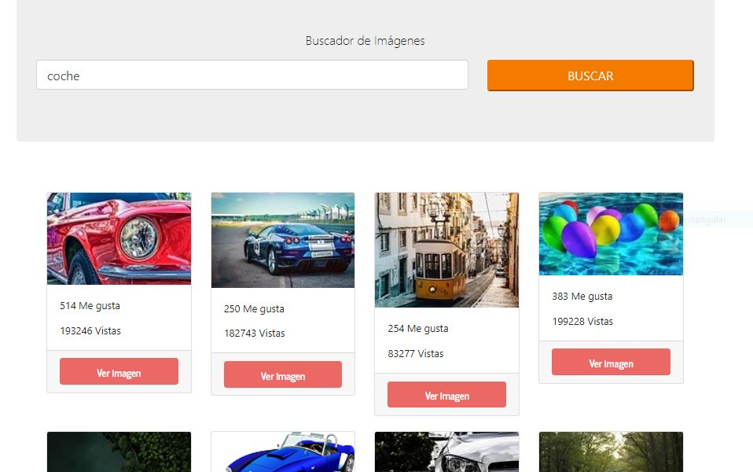

This project was bootstrapped with [Create React App](https://github.com/facebook/create-react-app).

## Available Scripts

In the project directory, you can run:

### `npm start`

Runs the app in the development mode. 
Open [http://localhost:3000](http://localhost:3000) to view it in the browser.

The page will reload if you make edits. 
You will also see any lint errors in the console.

### `DATOS DEL REPOSITORIO`
Desarrollo de ejercicio propuesto por el instructor Juan Pablo De la torre Valdez  en su curso de "React - La Guía Completa: Hooks Context Redux MERN +15 Apps" disponible en la plataforma de Udemy https://www.udemy.com/course/react-de-principiante-a-experto-creando-mas-de-10-aplicaciones/

### `DESCRIPCIÓN`
Buscador de imagenes a través de conexión a la API pixabay

### `IMAGENES APLICACIÓN`

